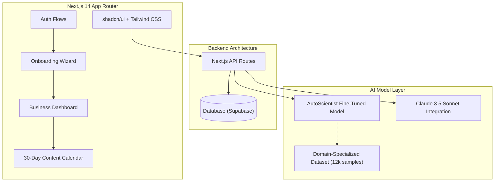

<div align="center">
  <h1>🚀 BrandPilot AI</h1>
  <h3>The AI Marketing Manager for Businesses That Can't Afford One</h3>
  <p><em>Dual Submission: AI for Marketers Hackathon + AutoScientist Challenge × HackIndia</em></p>

  [](https://nextjs.org/)
  [](https://tailwindcss.com/)
  [](https://www.typescriptlang.org/)
  [](https://anthropic.com/)

  <br />
  <h3>🔴 <a href="https://brand-pilot-ai.netlify.app/">Live Demo</a></h3>
</div>

<br />

> [!NOTE]  
> **The Insight**: 45% of small businesses say getting new customers is their #1 challenge. Only 18% feel confident their marketing is working. The owner IS the marketer — they have no time and no marketing knowledge. Existing AI tools require you to already know marketing to use them.
> **The Solution**: BrandPilot AI doesn't just "generate campaigns." It handles your marketing permanently by acting as an autonomous marketing manager.

---

## ✨ Features

- **Onboarding Wizard**: A 5-step intelligence gathering flow that analyzes the business's local competitors, audience, and digital footprint.
- **Brand DNA**: Automatically generates Core Positioning, Brand Voice, Target Personas, and USPs without the user needing to write a single prompt.
- **Automated Content Calendar**: A 30-day interactive view of scheduled content across Instagram, WhatsApp, Email, and Google Business Profile.
- **Pulse Reports**: Weekly intelligence briefs showing competitor movements and local trends to hijack.
- **Analytics & ROI**: Beautiful visualizations powered by Recharts showing Estimated Reach, Link Clicks, Leads, and ROI metrics.

---

## 🏗 Architecture & Tech Stack



- **Framework**: [Next.js 14](https://nextjs.org/) (App Router)
- **Styling**: [Tailwind CSS](https://tailwindcss.com/) & [shadcn/ui](https://ui.shadcn.com/)
- **Icons**: [Lucide React](https://lucide.dev/)
- **Charts**: [Recharts](https://recharts.org/)
- **AI Models**: Claude 3.5 Sonnet + Adaption AutoScientist Fine-Tuned Model

---

## 🎨 Design & Aesthetics

The platform features a **premium, glassmorphic dark mode** aesthetic designed to WOW users at first glance. 
- Vibrant gradients (`bg-gradient-to-r from-blue-600 to-indigo-600`) and glowing interactive elements.
- Smooth micro-animations using `framer-motion` and Tailwind utility classes (`transition-all`, `duration-500`).
- Responsive, modular components engineered for maximum scalability.

---

## 🚀 Getting Started

1. **Clone the repository**
```bash
git clone https://github.com/Devengoyal885/BrandPilot-AI1.git
cd "BrandPilot-AI1"
```

2. **Install dependencies**
```bash
npm install
```

3. **Run the development server**
```bash
npm run dev
```

4. **Open your browser**
Navigate to [http://localhost:3000](http://localhost:3000) to see the application running.

---

## 🤖 The Master Blueprint Prompt

<details>
<summary>Click to expand the Master Build Prompt used for BrandPilot AI</summary>

```markdown
# BrandPilot AI — Complete Project Blueprint
## "The AI Marketing Manager for Businesses That Can't Afford One"

> Dual submission: AI for Marketers Hackathon + AutoScientist Challenge × HackIndia (Marketing track)
> Author: Deven Goyal · Chandigarh University

---

## WHY THIS IDEA WINS

Every team at this hackathon will build a "campaign generator dashboard."
BrandPilot is completely different.

**The insight from real data:**
- 45% of small businesses say getting new customers is their #1 challenge
- Only 18% feel confident their marketing is working
- 38% have a monthly marketing budget under $2,500
- The owner IS the marketer — they have no time and no marketing knowledge
- Existing AI tools (Jasper, HubSpot, ChatGPT) all require you to already
  know marketing to use them

**The gap nobody has filled:**
A business owner doesn't want to "generate a campaign." They want someone to
HANDLE their marketing — permanently. They want to say "I own a gym in Chandigarh"
and have the AI automatically:
1. Figure out their brand voice
2. Schedule a month of Instagram posts
3. Send WhatsApp broadcasts to their leads
4. Write their Google Business updates
...without them ever having to type a "prompt."

BrandPilot replaces the marketing agency with an autonomous AI system.

════════════════════════════════════════════
PART 1 — THE MODEL (AutoScientist Submission)
════════════════════════════════════════════

**GOAL:** Train a fine-tuned marketing execution model that understands local
Indian business contexts better than off-the-shelf GPT-4.

**Dataset Construction (12,000 samples):**
- Synthetic generation using Claude across 12 industries (Local Bakery, Gym, Real Estate,
  B2B SaaS, Clinic, Salon, etc.)
- Features: text_copy, industry, channel (WhatsApp, IG, Email), intent (sale,
  awareness, engagement), tone_match_score (1-10).
- Special focus on conversational commerce (WhatsApp) which dominates Indian SMB marketing.

════════════════════════════════════════════
PART 2 — THE APPLICATION (AI for Marketers)
════════════════════════════════════════════

**Core Architecture & Flow:**

1. **The "Hire Your Manager" Onboarding (Crucial)**
   - No complex dashboards first.
   - User inputs: Business Name, Industry, City, Target Audience (optional), and uploads
     a menu/brochure or website link.
   - AI "Scans" the business (simulated progress bar: "Analyzing local competitors",
     "Determining brand voice", "Building 30-day strategy").

2. **The "Brand DNA" Engine (Core IP)**
   - The AI saves a permanent context file for the business containing its rules,
     forbidden words, primary offers, and tone of voice. All future outputs use this.

3. **The 30-Day Autopilot Calendar**
   - The UI shows a beautiful calendar already populated with tasks.
   - Example: "Tuesday 10 AM - Instagram Post about new Monsoon menu."
   - The user clicks "Approve" and the system marks it as ready to publish.

4. **The Weekly Pulse (Proactive AI)**
   - Instead of the user asking the AI for ideas, the AI messages the user:
     "Hey, it's raining heavily in Chandigarh this week. I've drafted a WhatsApp
     broadcast offering 20% off hot beverages. Should I send it to your 500 customers?"
```
</details>

---

## 👥 Contributors

- **Deven Goyal** (Developer & Architect)
- **Team Arclight**

> Built with ❤️ at Chandigarh University for the AI for Marketers Hackathon & HackIndia AutoScientist Challenge.
